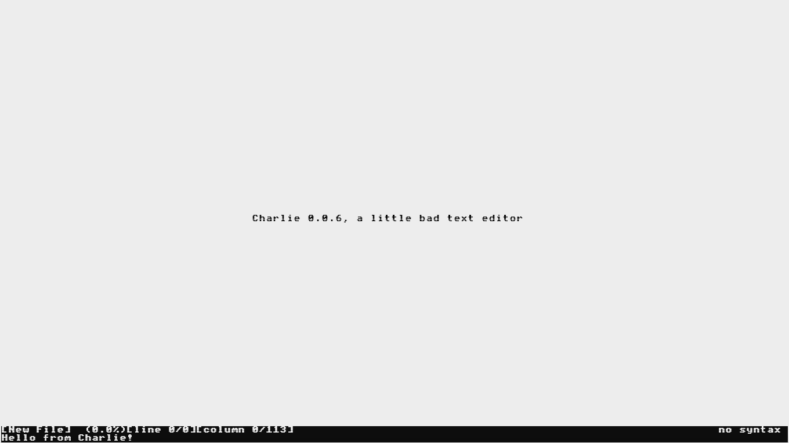
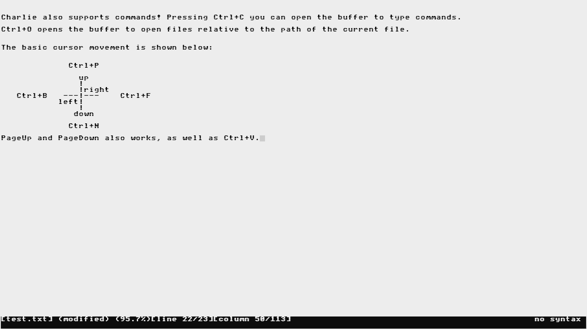
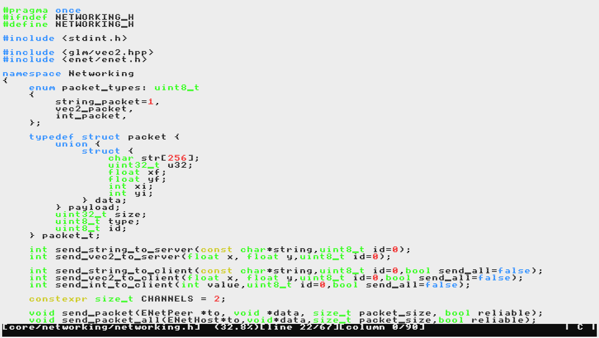
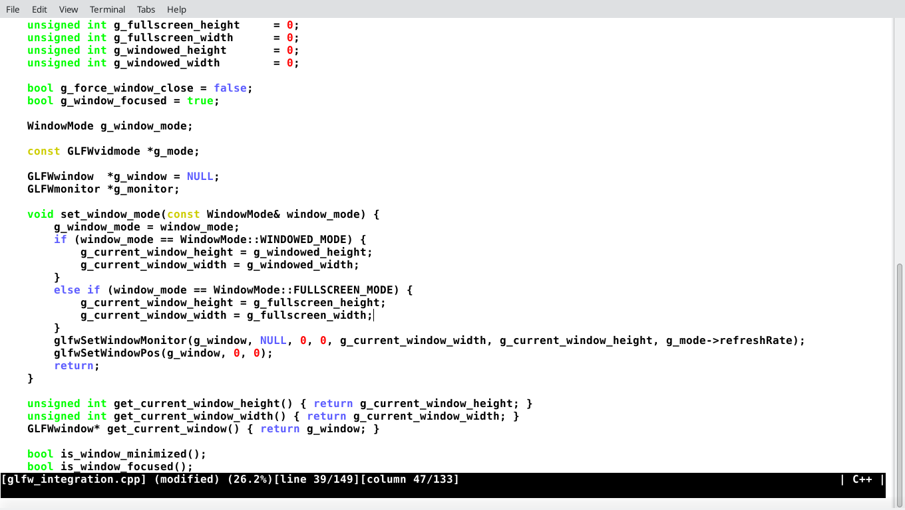

# Charlie Text Editor


Charlie is a minimal text editor highly inspired by Emacs and [kilo](https://github.com/antirez/kilo.git) written in C programming language.

*This project has no -- and probably will never have -- the purpose to be a complete, finished, and polished software. It started as a learning project and is part of one day-dreamer idea
of mine of using only softwares and tools developed by me. With that said, the current application will -- and already does -- have bugs and problems, besides, of course, the fact it was
designed to fit only and exclusively my needs. Despite that, any contribution is more than welcome.*

# Dependencies

As I wrote some lines above, the project is highly inspired by kilo, which means it has no more dependencies than a C compiler and its standard library -- in the case of this project, clang 19.0.0+.

It uses the VT100 stardard escape sequences as main control for cursor movement, text formatting and displaying of the text in general.

# Build
*not tested in a windows or mac environment*

```bash

 > sh build.sh

```

and follow the instructions.

# FEATURES

 - 12 different commands;
 - Open, save and 'save as' system;
 - Status bar and command bar;
 - Syntax highlighting for C/C++ languages;

# IMAGES







# TODO

 - [ ] Line numbers;
 - [ ] UTF8 support;
 - [ ] Bigger status messages;
 - [ ] Command history;
 - [ ] Emacs IDO-mode-like command bar;
 - [ ] .

# Other

If anyone's curious: I am using the "feminine version" of Charlie name.

